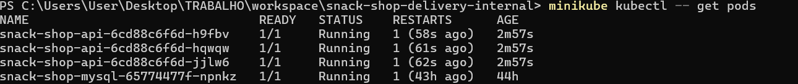
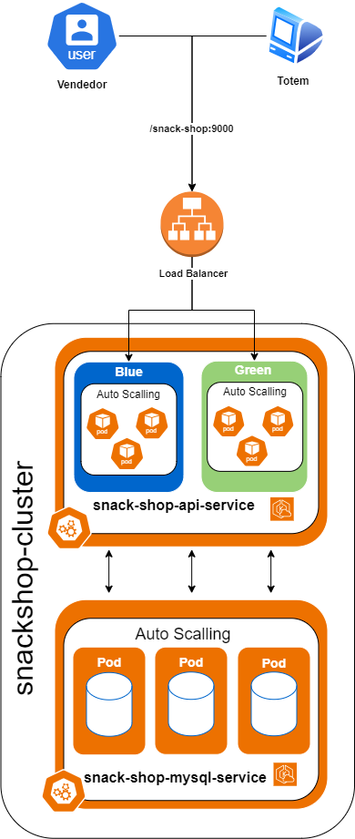

[English](README.md) | [Português](README.pt.md)

[](https://www.oracle.com/java/technologies/javase-jdk11-downloads.html)
[](https://spring.io/)
[](https://maven.apache.org/)
[](https://www.docker.com/)
[](https://www.mysql.com/)
[](https://kubernetes.io/)
[](https://aws.amazon.com/)

# Snack Shop API

## 📝 Descripción

La API de Snack Shop es un sistema de gestión para cafeterías que ofrece una serie de ventajas. Permite realizar pedidos de manera eficiente e intuitiva, mejorando la experiencia del cliente y optimizando el tiempo de los empleados.

La aplicación "Snack Shop API" es un sistema de gestión para cafeterías. Está diseñado para mejorar la eficiencia operativa y proporcionar una experiencia superior a los clientes. Estos son los principales requisitos comerciales que cumple la aplicación:

1. Gestión de Pedidos: La aplicación permite realizar pedidos de manera eficiente e intuitiva. Los usuarios pueden listar todos los pedidos, listar un pedido por ID, agregar un pedido y actualizar el estado de un pedido.

2. Gestión de Usuarios: La aplicación permite la gestión de usuarios. Los usuarios pueden ser listados, agregados, actualizados y eliminados. Además, los usuarios pueden ser agregados a grupos y sus contraseñas pueden ser cambiadas.

3. Gestión de Grupos: La aplicación permite la gestión de grupos de usuarios. Los grupos pueden ser listados, agregados, actualizados y eliminados. Además, los permisos pueden ser listados, agregados y eliminados de un grupo.

4. Gestión de Productos: La aplicación permite la gestión de productos. Los productos pueden ser listados, agregados, actualizados y eliminados.

5. Gestión de Ingredientes: La aplicación permite la gestión de ingredientes. Los ingredientes pueden ser listados, agregados, actualizados y eliminados.

6. Gestión de Métodos de Pago: La aplicación permite la gestión de métodos de pago. Los métodos de pago pueden ser listados, agregados, actualizados y eliminados.

7. Gestión de Cafeterías: La aplicación permite la gestión de cafeterías. Las cafeterías pueden ser listadas, agregadas, actualizadas y activadas/desactivadas. Además, se pueden gestionar los productos, formas de pago y administradores de una cafetería.

En resumen, la API de Snack Shop es una solución completa para cafeterías que buscan mejorar su eficiencia operativa y proporcionar una experiencia superior a sus clientes.

## 📄 Diagramas de negocio
- [Procesos](https://miro.com/app/board/uXjVNzyqNFE=/)
- Diagrama de Objetos
  

## 💻 Tecnologías

Las siguientes herramientas se utilizaron en la construcción del proyecto:

- [Java](https://www.java.com)
- [Spring Boot](https://spring.io/projects/spring-boot)
- [Maven](https://maven.apache.org/)
- [SQL](https://www.mysql.com/)
## ✅ Requisitos previos

Antes de comenzar, necesitarás tener instaladas las siguientes herramientas en tu máquina:
- [Docker](https://www.docker.com/products/docker-desktop)
- [Docker Compose](https://docs.docker.com/compose/install/)

## Arquitectura


## 🚀 Cómo ejecutar el proyecto

### ⚙️ Ejecutando el Backend (servidor)

```bash
# Clona este repositorio
$ git clone https://github.com/joseppamancio/snack-shop-api.git

# Accede al directorio del proyecto en la terminal/cmd
$ cd snack-shop-delivery

# Usa Docker Compose para iniciar la aplicación y la base de datos
$ docker-compose up
```

Al ejecutar el comando docker-compose up, Docker Compose inicia la aplicación y la base de datos en contenedores separados, pero en la misma red Docker. Esto permite que la aplicación y la base de datos se comuniquen entre sí. La base de datos se inicia en el puerto predeterminado 3306.

La aplicación Spring Boot, por su parte, se conecta a esta base de datos a través de la red Docker. Cuando se inicia la aplicación Spring Boot, se ejecuta Flyway. Flyway es una herramienta de migración de bases de datos que ayuda a administrar y aplicar cambios en el esquema de la base de datos. Crea las tablas necesarias para la interacción con la aplicación, como las tablas de pedidos, usuarios, productos e ingredientes.

Después de crear las tablas, se ejecuta un script llamado afterMigrate.sql. Este script llena las tablas con datos ficticios, lo que le permite probar la aplicación. Finalmente, la aplicación se expone en el puerto 9000. Puedes interactuar con la aplicación a través de un cliente HTTP como Postman, llamando a los respectivos puntos finales de la API.

## 📝 Documentación de la API

Para probar la aplicación, proporcionamos una colección de Postman que contiene varias solicitudes preconfiguradas. Esta colección se encuentra en el directorio src/main/resources/collections del proyecto. Para importar la colección en Postman, siga los siguientes pasos:

1. Abra Postman.
2. Haga clic en el botón "Importar" en la esquina superior izquierda.
3. En la ventana que se abre, seleccione la opción "Archivo".
4. Navegue hasta el directorio src/main/resources/collections del proyecto y seleccione el archivo de la colección.
5. Haga clic en "Abrir" para importar la colección.

Después de importar la colección, verá una lista de solicitudes en el panel izquierdo de Postman. Puede hacer clic en cualquiera de estas solicitudes para abrirla y luego hacer clic en el botón "Enviar" para enviar la solicitud a la aplicación. Recuerde que la aplicación debe estar ejecutándose en el puerto 9000 para que pueda interactuar con ella a través de Postman.

### 👥 Grupos

Para enumerar los grupos registrados en la aplicación, definimos una carpeta dentro de la colección llamada Grupos, en la que encontrará las siguientes solicitudes:

- Enumerar todos los grupos
- Enumerar grupo por ID
- Agregar grupo
- Actualizar grupo
- Eliminar grupo
- Enumerar permisos del grupo
- Agregar permiso al grupo
- Eliminar permiso del grupo

### Ejemplo de Solicitud
- Buscar grupo por ID
  

### 👤 Usuarios

Para enumerar los usuarios registrados en la aplicación, definimos una carpeta dentro de la colección llamada Usuarios, en la que encontrará las siguientes solicitudes:

- Enumerar todos los usuarios
- Enumerar usuario por ID
- Enumerar grupo de usuarios
- Agregar usuario al grupo
- Eliminar usuario del grupo
- Agregar usuario
- Actualizar usuario
- Eliminar usuario
- Cambiar contraseña del usuario

### Ejemplo de Solicitud
- Agregar usuario
  

### 🛒 Pedidos

Para enumerar los pedidos registrados en la aplicación, definimos una carpeta dentro de la colección llamada Pedidos, en la que encontrará las siguientes solicitudes:

- Enumerar todos los pedidos
- Enumerar pedido por ID
- Agregar pedido
- Actualizar estado del pedido

### Ejemplo de Solicitud
- Enumerar pedidos
  Al enumerar los pedidos, podemos filtrar por estado, rango de fechas de creación y usuario.
  

### 💳 Métodos de Pago

Para enumerar los métodos de pago registrados en la aplicación, definimos una carpeta dentro de la colección llamada Métodos de Pago, en la que encontrará las siguientes solicitudes:

- Enumerar todos los métodos de pago
- Enumerar método de pago por ID
- Agregar método de pago
- Actualizar método de pago
- Eliminar método de pago

### Ejemplo de Solicitud
- Enumerar métodos de pago
  


### 🍔 Hamburgueserías

Para enumerar las hamburgueserías registradas en la aplicación, definimos una carpeta dentro de la colección llamada Hamburgueserías, en la que encontrará las siguientes solicitudes:

- Enumerar todas las hamburgueserías
- Enumerar hamburguesería por ID
- Agregar hamburguesería
- Actualizar hamburguesería
- Activar/Desactivar hamburguesería
- Lista de productos de la hamburguesería
- Lista de formas de pago de la hamburguesería
- Agregar forma de pago a la hamburguesería
- Eliminar forma de pago de la hamburguesería
- Lista de administradores de la hamburguesería
- Agregar administrador a la hamburguesería
- Eliminar administrador de la hamburguesería

### Ejemplo de Solicitud
- Enumerar hamburgueserías
  

### 📦 Productos

Para enumerar los productos registrados en la aplicación, definimos una carpeta dentro de la colección llamada Productos, en la que encontrará las siguientes solicitudes:

- Enumerar todos los productos
- Enumerar producto por ID
- Agregar producto
- Actualizar producto
- Eliminar producto

### Ejemplo de Solicitud
- Agregar producto
  

### 🥕 Ingredientes

Para enumerar los ingredientes registrados en la aplicación, definimos una carpeta dentro de la colección llamada Ingredientes, en la que encontrará las siguientes solicitudes:

- Enumerar todos los ingredientes
- Enumerar ingrediente por ID
- Agregar ingrediente
- Actualizar ingrediente
- Eliminar ingrediente
- Lista de ingredientes en stock

### Ejemplo de Solicitud
- Enumerar ingredientes en stock
  

---------------------------------------

# Implementando Microservicios en Kubernetes Local con Minikube

### Prerrequisitos
* Docker (Instalación: https://www.docker.com/get-started/)
* Chocolatey (Instalación: https://chocolatey.org/install)
* Minikube (Instalación: https://minikube.sigs.k8s.io/docs/start/)
* Istio (Instalación: https://istio.io/latest/docs/setup/getting-started/)


### Arquitectura con Kubernetes Local


### Instalación de Minikube

Debes tener Minikube instalado para crear un clúster de Kubernetes localmente. Consulta la documentación oficial de Minikube para obtener instrucciones de instalación.
Podemos instalar Minikube usando Chocolatey:

    choco install minikube

### Acceso al Proyecto
Dirígete al directorio del proyecto:

    cd snack-shop-delivery-internal

## Ejecutando Minikube
### Inicia Minikube:

    minikube start


## Implementación del Clúster
A continuación, vamos a implementar la aplicación en el clúster de Kubernetes local utilizando Minikube.

# Configuración del entorno Docker para usar Minikube
Ingresando al terminal de Minikube:
### UNIX
    eval $(minikube -p minikube docker-env)
### WINDOWS
    minikube -p minikube docker-env | Invoke-Expression

### Verificación de las imágenes de Docker
Verifica si las imágenes de Docker están disponibles para Minikube:

    docker images

### Construcción de la aplicación
Construye la aplicación usando Docker Compose:

    docker-compose build


### Verificación de kubectl
    minikube kubectl -- version

### Preparación de los archivos de la aplicación
Aplicando los archivos de implementación y servicio de la aplicación:

    minikube kubectl -- apply -f ./k8s/00-snack-shop-mysql.yml

### Verifica si el servicio de MySQL está en funcionamiento antes de subir la aplicación
    minikube kubectl -- get pods


### Aplicando los archivos de la aplicación
Con MySQL en funcionamiento, aplica los archivos de la aplicación:

    minikube kubectl -- apply -f ./k8s/01-snack-shop-api-local.yml


### Verificar los pods
Verifica si los pods están en funcionamiento:

    minikube kubectl -- get pods




### Activar el servicio de Balance de Carga
Abre un nuevo terminal y ejecuta el siguiente comando para activar el servicio de Balance de Carga y exponer la IP de la aplicación:

    minikube tunnel


### Verificar los servicios en funcionamiento
Después de activar el servicio de Balance de Carga, verifica los servicios en funcionamiento:

    minikube kubectl -- get services


### Probar en Postman
Después de la implementación, prueba los servicios usando Postman con la IP proporcionada por el comando ' minikube kubectl -- get services' en el puerto 9000.


### Instalación de Istio
Puedes instalar Istio como un Service Mesh o Proxy Sidecar. Consulta la documentación oficial de Istio para obtener más información.
Podemos instalar Istio usando Chocolatey:

    choco install istioctl

### Configurar Istio
Después de la instalación, configura Istio:

    istioctl install


### Habilitar Istio para el espacio de nombres por defecto
    kubectl label namespace default istio-injection=enabled

### Aplicar archivos del API Gateway
Aplica los archivos del API Gateway:

    minikube kubectl -- apply -f ./k8s/istio/gateway.yml


### Verificar el servicio
    minikube kubectl -- -n istio-system get services

## Configuración del Escalamiento Automático
Para configurar el Escalamiento Automático, sigue los siguientes pasos:

### Habilitar métricas
    minikube addons enable metrics-server

### Aplicar el servicio
    minikube kubectl -- apply -f ./k8s/02-hpa.yml

### Verificar el Escalamiento Automático
    minikube kubectl -- get hpa

Este Readme proporciona instrucciones detalladas para implementar y probar microservicios usando Kubernetes.
Asegúrate de seguir cada paso cuidadosamente para una implementación exitosa.

---------------------------------------

# Implementando Microservicios en la Nube de AWS con EKS y Terraform

### Prerrequisitos
* Docker (Instalación: https://www.docker.com/get-started/)
* Chocolatey (Instalación: https://chocolatey.org/install)
* Terraform (Instalación: https://developer.hashicorp.com/terraform/tutorials/aws-get-started/install-cli)


### Arquitectura en la Nube de AWS



### Instalación de Terraform
Podemos instalar Terraform usando Chocolatey:
choco install terraform

### Accediendo a los archivos de Terraform
Navega al directorio del proyecto:

    cd snack-shop-delivery-internal/terraform

### Creación del Clúster EKS y Ambiente de AWS
    terraform apply --auto-approve

### Conectar con el Clúster
    aws eks --region us-west-2 update-kubeconfig --name snackshop-cluster

### Crear Imagen Docker
    docker-compose build

### Verificar las imágenes de Docker
    docker images

### Subir imagen en ECR usando comando de AWS
    aws ecr get-login-password --region us-west-2 | docker login --username AWS --password-stdin ************.dkr.ecr.us-west-2.amazonaws.com
    docker build -t snack-shop-delivery-internal-snack-shop-api .    
    docker tag snack-shop-delivery-internal-snack-shop-api:latest ************.dkr.ecr.us-west-2.amazonaws.com/snack-shop-delivery-internal-snack-shop-api:latest
    docker push ************.dkr.ecr.us-west-2.amazonaws.com/snack-shop-delivery-internal-snack-shop-api:latest

### Verificar kubectl
    kubectl version

### Verificar los nodos creados
    kubectl get nodes


### Preparación de los archivos de la aplicación
Aplicando los archivos de despliegue y servicio de la aplicación:

    kubectl apply -f ..\k8s\00-snack-shop-mysql.yml

### Verificar si el servicio de MySQL está en funcionamiento antes de subir la aplicación
    kubectl get pods


### Aplicando los archivos de la aplicación
Con MySQL en funcionamiento, aplica los archivos de la aplicación:

    kubectl apply -f ..\k8s\01-snack-shop-api.yml


### Aplicar los archivos del API Gateway

    kubectl apply -f ..\k8s\02-hpa.yml

### Verificar el estado de la implementación
    kubectl get deployments

### Verificar los pods en funcionamiento
    kubectl get pods

### Verificación de los Servicios
    kubectl get services


### Verificar los Logs
    kubectl logs -f <nombre-del-pod> --tail

### Probar en Postman
Después de la implementación, prueba los servicios usando Postman con el DNS de AWS proporcionado por el comando 'kubectl get services' en el puerto 9000.


# Ejecutando la aplicación en AWS con EKS
Este es un ejemplo de cómo ejecutar la aplicación en AWS usando EKS. Para ejecutar la aplicación en AWS, sigue los pasos a continuación:


