[Português](README.pt.md) | [Español](README.es.md)

[](https://www.oracle.com/java/technologies/javase-jdk11-downloads.html)
[](https://spring.io/)
[](https://maven.apache.org/)
[](https://www.docker.com/)
[](https://www.mysql.com/)
[](https://kubernetes.io/)
[](https://aws.amazon.com/)

# Snack Shop API

## 📝 Description

The Snack Shop API is a management system for snack bars that offers a series of advantages. It allows for efficient and intuitive ordering, improving the customer experience and optimizing employee time.

The "Snack Shop API" application is a management system for snack bars. It is designed to improve operational efficiency and provide a superior experience to customers. Here are the main business requirements that the application meets:

1. Order Management: The application allows for efficient and intuitive ordering. Users can list all orders, list an order by ID, add an order, and update the status of an order.

2. User Management: The application allows for user management. Users can be listed, added, updated, and removed. Additionally, users can be added to groups and have their passwords changed.

3. Group Management: The application allows for the management of user groups. Groups can be listed, added, updated, and removed. Additionally, permissions can be listed, added, and removed from a group.

4. Product Management: The application allows for product management. Products can be listed, added, updated, and removed.

5. Ingredient Management: The application allows for ingredient management. Ingredients can be listed, added, updated, and removed.

6. Payment Method Management: The application allows for payment method management. Payment methods can be listed, added, updated, and removed.

7. Snack Bar Management: The application allows for snack bar management. Snack bars can be listed, added, updated, and activated/deactivated. Additionally, the products, payment methods, and administrators of a snack bar can be managed.

In summary, the Snack Shop API is a comprehensive solution for snack bars looking to improve their operational efficiency and provide a superior experience to their customers.

## 📄 Business Diagrams
- [Processes](https://miro.com/app/board/uXjVNzyqNFE=/)
- Object Diagram
  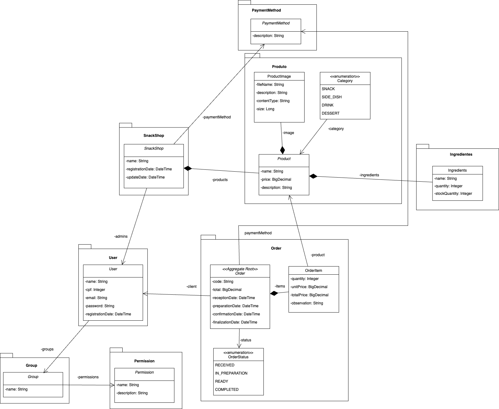

## 💻 Technologies

The following tools were used in the project:

- [Java](https://www.java.com)
- [Spring Boot](https://spring.io/projects/spring-boot)
- [Maven](https://maven.apache.org/)
- [SQL](https://www.mysql.com/)

## ✅ Prerequisites

Before you begin, you will need to have the following tools installed on your machine:
- [Docker](https://www.docker.com/products/docker-desktop)
- [Docker Compose](https://docs.docker.com/compose/install/)

## Architecture
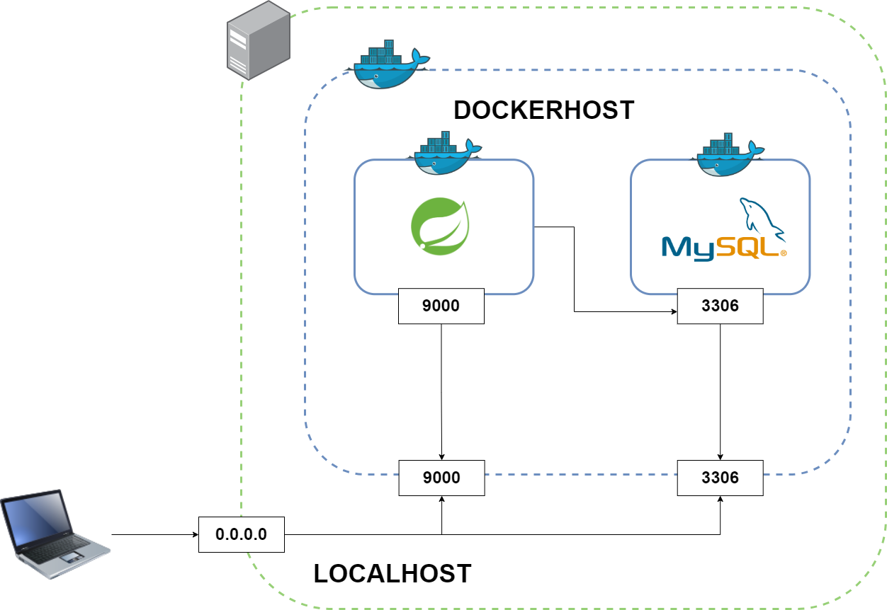

## 🚀 How to run the project

### ⚙️ Running the Backend (server)

```bash
# Clone this repository
$ git clone https://github.com/joseppamancio/snack-shop-api.git

# Access the project folder in the terminal/cmd
$ cd snack-shop-delivery

# Use Docker Compose to start the application and the database
$ docker-compose up
```

When you run the docker-compose up command, Docker Compose starts the application and the database in separate containers, but on the same Docker network. This allows the application and the database to communicate with each other. The database is started on the default port 3306.

The Spring Boot application, in turn, connects to this database through the Docker network. When the Spring Boot application starts, Flyway is executed. Flyway is a database migration tool that helps manage and apply changes to the database schema. It creates the necessary tables for interacting with the application, such as orders, users, products, and ingredients.

After creating the tables, a script called afterMigrate.sql is executed. This script populates the tables with fictitious data, allowing you to test the application. Finally, the application is exposed on port 9000. You can interact with the application through an HTTP client like Postman, calling the respective API endpoints.

## 📝 API Documentation

To test the application, we provide a Postman collection containing several pre-configured requests. This collection is located in the src/main/resources/collections directory of the project. To import the collection into Postman, follow the steps below:

1. Open Postman.
2. Click on the "Import" button in the top left corner.
3. In the window that opens, select the "File" option.
4. Navigate to the src/main/resources/collections directory of the project and select the collection file.
5. Click "Open" to import the collection.

After importing the collection, you will see a list of requests in the left panel of Postman. You can click on any of these requests to open it and then click the "Send" button to send the request to the application. Remember that the application must be running on port 9000 for you to interact with it through Postman.

### 👥 Groups

To list the groups registered in the application, we defined a folder within the Collection called Groups. In it, you will find the following requests:

- List all groups
- List group by ID
- Add Group
- Update Group
- Remove Group
- List Group Permissions
- Add Permission to Group
- Remove Permission from Group

### Request Example
- Finding Group by ID
  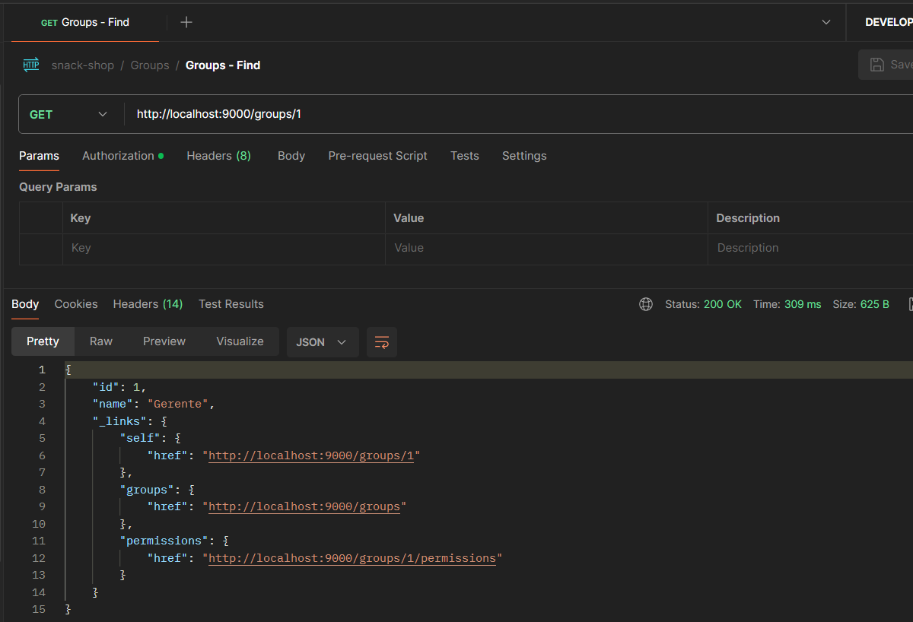

### 👤 Users

To list the users registered in the application, we defined a folder within the Collection called Users. In it, you will find the following requests:

- List all users
- List user by ID
- List User Group
- Add User to Group
- Remove User from Group
- Add User
- Update User
- Remove User
- Change User Password

### Request Example
- Adding User
  


### 🛒 Orders

To list the orders registered in the application, we defined a folder within the Collection called Orders. In it, you will find the following requests:

- List all orders
- List order by ID
- Add Order
- Update Order Status

### Request Example
- Listing Orders
  When listing orders, we can filter by status, creation date range, and user.
  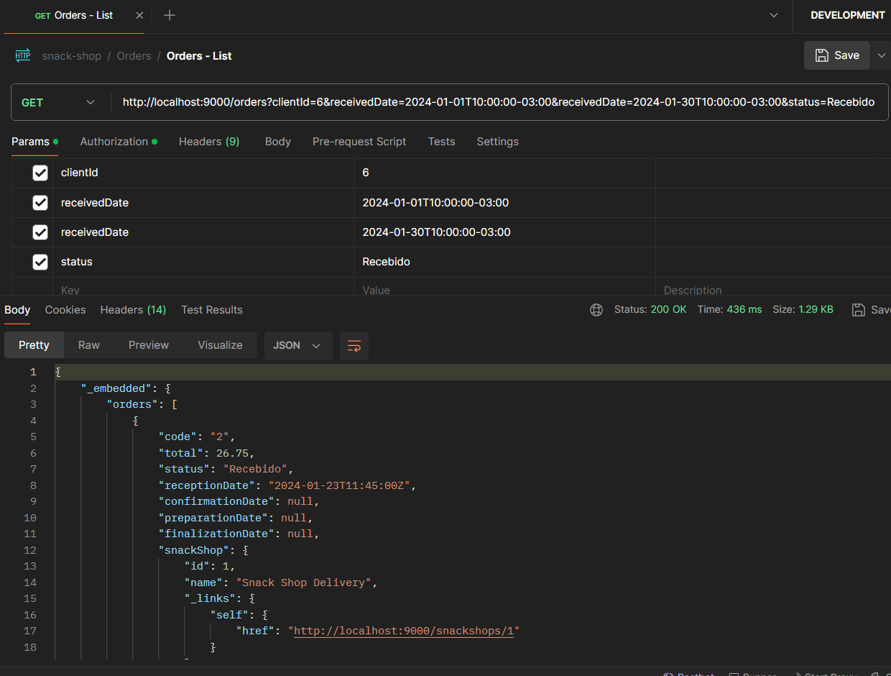


### 💳 Payment Methods

To list the payment methods registered in the application, we defined a folder within the Collection called Payment Methods. In it, you will find the following requests:

- List all payment methods
- List payment method by ID
- Add Payment Method
- Update Payment Method
- Remove Payment Method

### Request Example
- Listing Payment Methods
  

### 🍔 Snack Bars

To list the snack bars registered in the application, we defined a folder within the Collection called Snack Bars. In it, you will find the following requests:

- List all snack bars
- List snack bar by ID
- Add Snack Bar
- Update Snack Bar
- Activate/Deactivate Snack Bar
- Snack Bar Product List
- Snack Bar Payment Methods List
- Add Payment Method to Snack Bar
- Remove Payment Method from Snack Bar
- Snack Bar Administrators List
- Add Administrator to Snack Bar
- Remove Administrator from Snack Bar

### Request Example
- Listing Snack Bars
  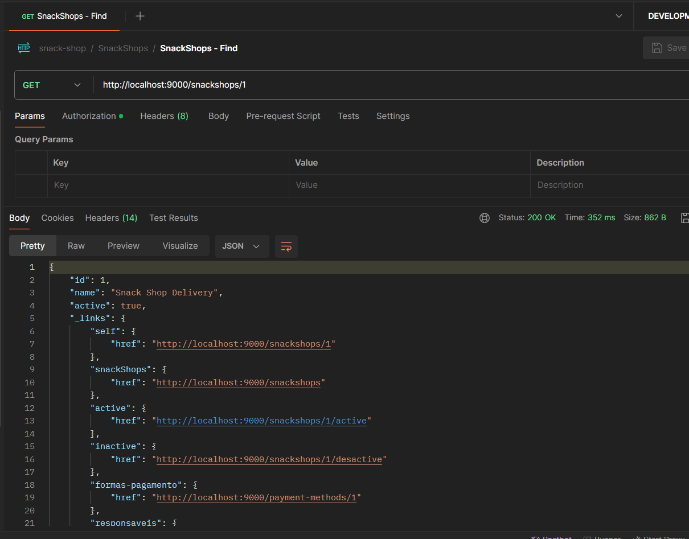


### 📦 Products

To list the products registered in the application, we defined a folder within the Collection called Products. In it, you will find the following requests:

- List all products
- List product by ID
- Add Product
- Update Product
- Remove Product

### Request Example
- Adding Product
  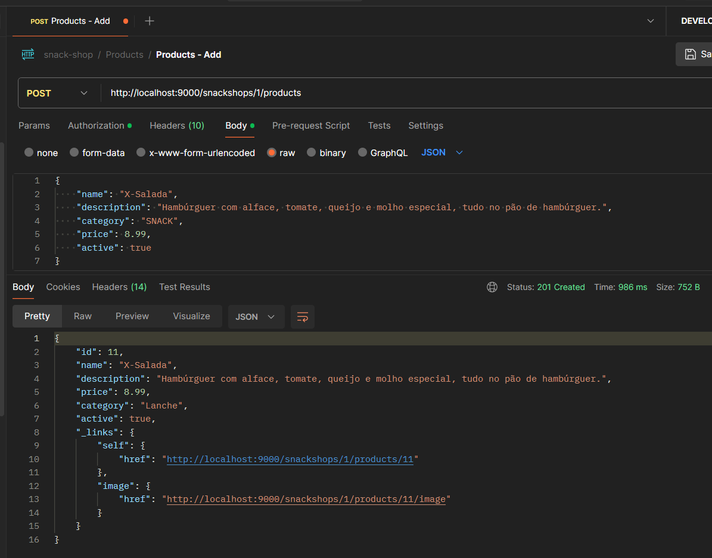


### 🥕 Ingredients

To list the ingredients registered in the application, we defined a folder within the Collection called Ingredients. In it, you will find the following requests:

- List all ingredients
- List ingredient by ID
- Add Ingredient
- Update Ingredient
- Remove Ingredient
- List Ingredients in Stock


### Request Example
- Listing Ingredients in Stock
  

---------------------------------------

# Implementing Microservices in Local Kubernetes with Minikube

### Prerequisites
* Docker (Installation: https://www.docker.com/products/docker-desktop)
* Chocolatey (Installation: https://chocolatey.org/install)
* Minikube (Installation: https://minikube.sigs.k8s.io/docs/start/)
* Istio (Installation: https://istio.io/latest/docs/setup/getting-started/)


### Local Kubernetes Architecture
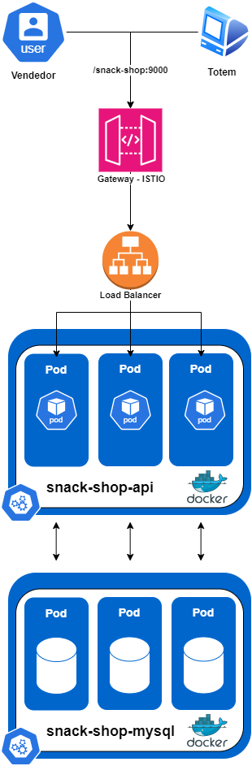

### Installing Minikube

You need to have Minikube installed to create a local Kubernetes cluster. Refer to the official Minikube documentation for installation instructions.
We can install Minikube using Chocolatey:

    choco install minikube

### Accessing the Project
Navigate to the project directory:

    cd snack-shop-delivery-internal

## Running Minikube
### Start Minikube:

    minikube start

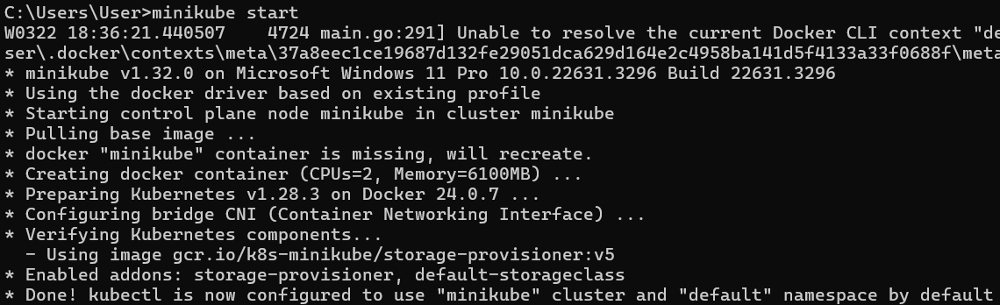

## Cluster Deployment
Next, we'll deploy the application on the local Kubernetes cluster using Minikube.

# Set up Docker environment to use Minikube
Enter the Minikube terminal:

### UNIX
    eval $(minikube -p minikube docker-env)
### WINDOWS
    minikube -p minikube docker-env | Invoke-Expression

### Check Docker images
Check if Docker images are available for Minikube:

    docker images

### Build the application
Build the application using Docker Compose:

    docker-compose build

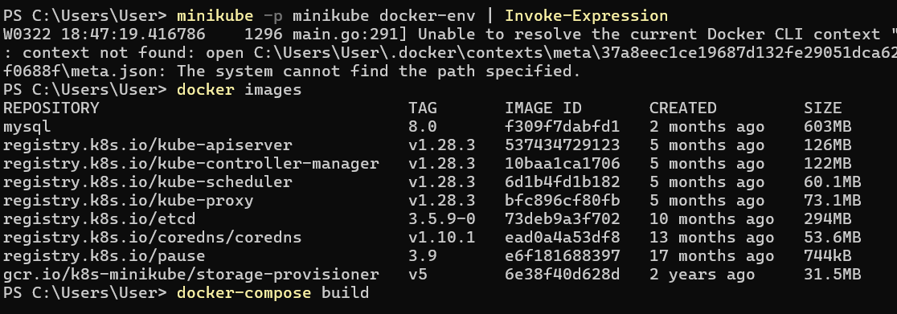

### Check kubectl
    minikube kubectl -- version

### Prepare application files
Applying the application's deployment and service files:

    minikube kubectl -- apply -f ./k8s/00-snack-shop-mysql.yml

### Check if the MySQL service is running before deploying the application
    minikube kubectl -- get pods

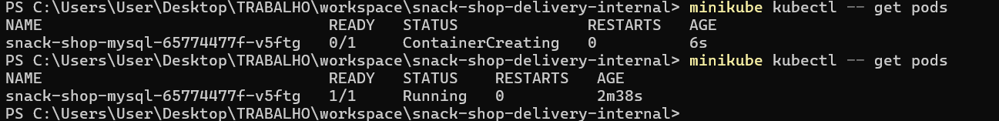


### Applying the application files
With MySQL running, apply the application files:

    minikube kubectl -- apply -f ./k8s/01-snack-shop-api-local.yml


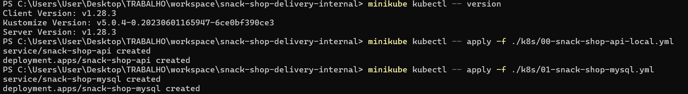


### Enable Load Balance service
Open a new terminal and run the following command to enable the Load Balance service and expose the application's IP:

    minikube tunnel

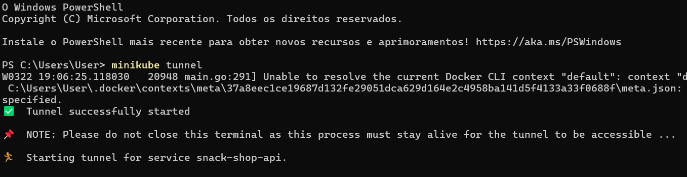

### Check running services
After enabling the Load Balance service, check the running services:

    minikube kubectl -- get services

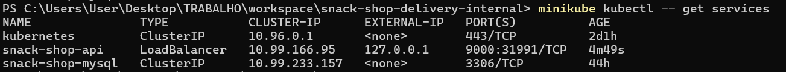

### Test in Postman
After deployment, test the services using Postman with the IP provided by the 'minikube kubectl -- get services' command on port 9000.

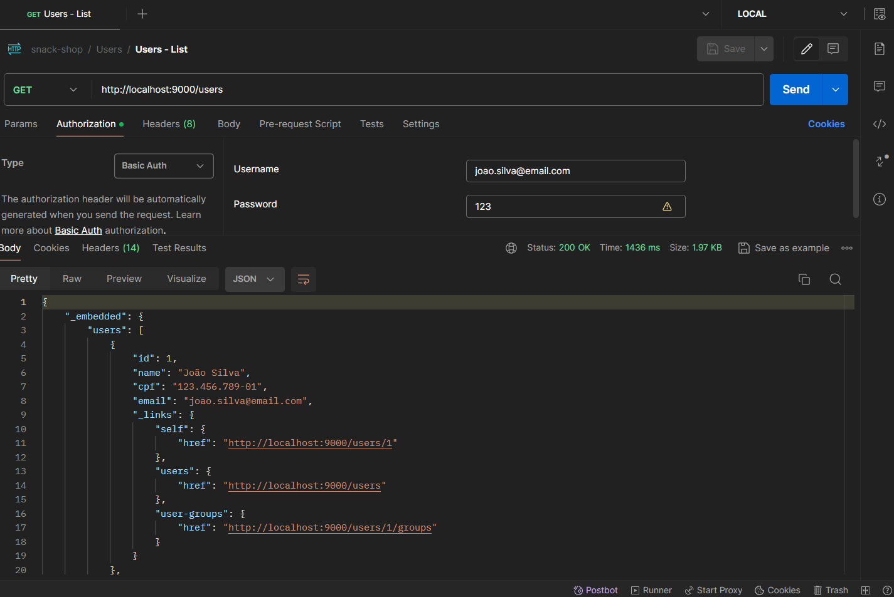

### Installing Istio
You can install Istio as a Service Mesh or Sidecar Proxy. Refer to the official Istio documentation for more information.
We can install Istio using Chocolatey:

    choco install istioctl

### Configure Istio
After installation, configure Istio:

    istioctl install

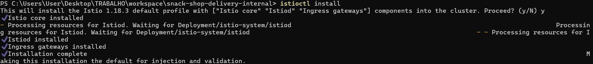

### Enable Istio for the default namespace
    kubectl label namespace default istio-injection=enabled

### Applying API Gateway Files
Apply the API Gateway files:

    minikube kubectl -- apply -f ./k8s/istio/gateway.yml

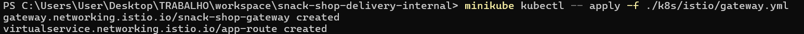

### Verify the service
    minikube kubectl -- -n istio-system get services

## Configuring AutoScaling
To configure AutoScaling, follow the steps below:

### Enable metrics
    minikube addons enable metrics-server

### Apply the service
    minikube kubectl -- apply -f ./k8s/02-hpa.yml

### Verify AutoScaling
    minikube kubectl -- get hpa

This README provides detailed instructions for deploying and testing microservices in local Kubernetes environments and on AWS cloud using Terraform. Make sure to follow the instructions carefully for a successful deployment.

---------------------------------------

# Implementing Microservices on AWS Cloud with EKS and Terraform

### Prerequisites
* Docker (Installation: https://www.docker.com/get-started/)
* Chocolatey (Installation: https://chocolatey.org/install)
* Terraform (Installation: https://developer.hashicorp.com/terraform/tutorials/aws-get-started/install-cli)


### Architecture with Local Kubernetes


### Installing Terraform
You can install Terraform using Chocolatey:
choco install terraform

### Accessing Terraform files
Navigate to the project directory:

    cd snack-shop-delivery-internal/terraform

### Creating EKS Cluster and AWS Environment
    terraform apply --auto-approve

### Connecting to Cluster
    aws eks --region us-west-2 update-kubeconfig --name snackshop-cluster

### Creating Docker Image
    docker-compose build

### Verifying Docker images
    docker images

### Pushing image to ECR using AWS command
    aws ecr get-login-password --region us-west-2 | docker login --username AWS --password-stdin ************.dkr.ecr.us-west-2.amazonaws.com
    docker build -t snack-shop-delivery-internal-snack-shop-api .    
    docker tag snack-shop-delivery-internal-snack-shop-api:latest ************.dkr.ecr.us-west-2.amazonaws.com/snack-shop-delivery-internal-snack-shop-api:latest
    docker push ************.dkr.ecr.us-west-2.amazonaws.com/snack-shop-delivery-internal-snack-shop-api:latest

### Verifying kubectl
    kubectl version

### Verifying created nodes
    kubectl get nodes

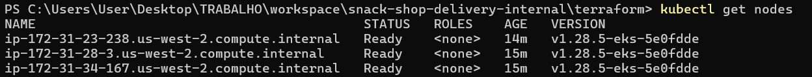

### Preparing application files
Applying application deployment and service files:

    kubectl apply -f ..\k8s\00-snack-shop-mysql.yml

### Check if MySQL service is running before deploying the application
    kubectl get pods


### Applying application files
With MySQL running, apply application files:

    kubectl apply -f ..\k8s\01-snack-shop-api.yml


### Applying API Gateway files

    kubectl apply -f ..\k8s\02-hpa.yml

### Verifying deployment status
    kubectl get deployments

### Verifying running pods
    kubectl get pods

### Checking Services
    kubectl get services

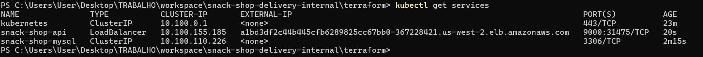


### Checking Logs
    kubectl logs -f <pod-name> --tail

### Testing in Postman
After deployment, test the services using Postman with the AWS DNS provided by 'kubectl get services' command on port 9000.

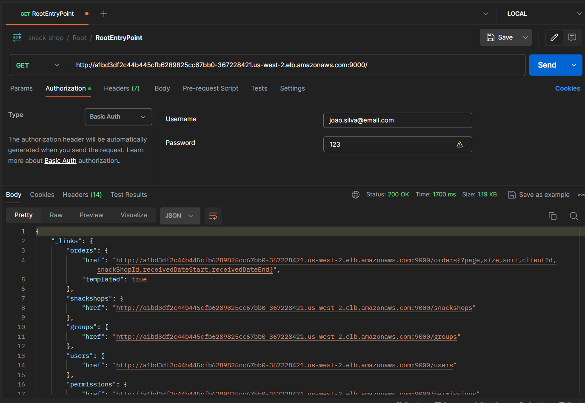


# Running the Application on AWS with EKS
This is an example of running the application on AWS using EKS. To run the application on AWS, follow the steps below:


